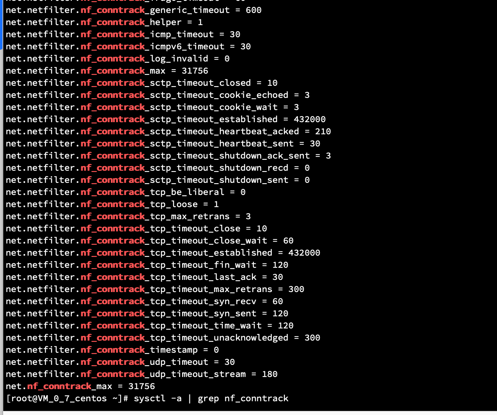
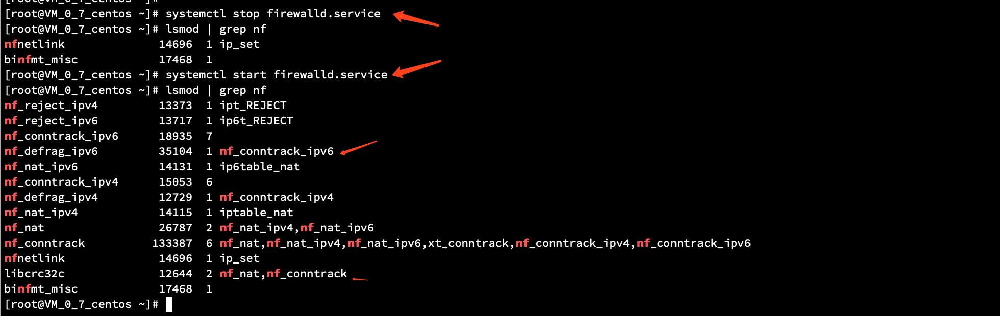
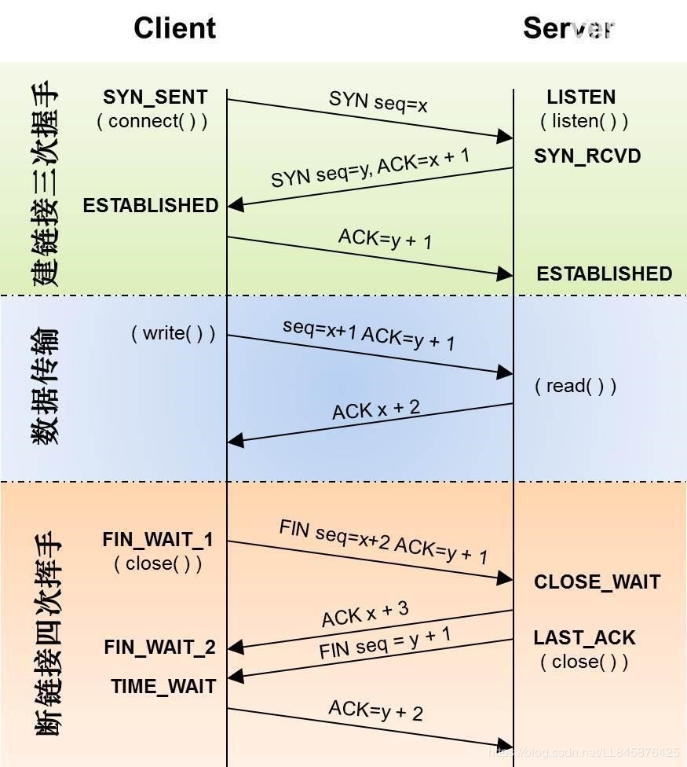
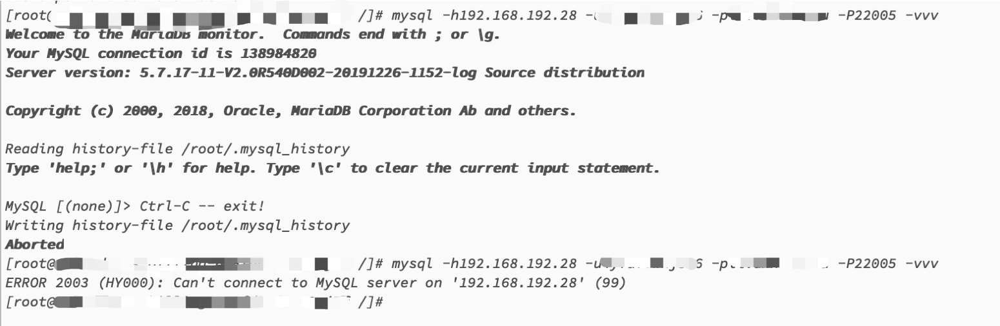
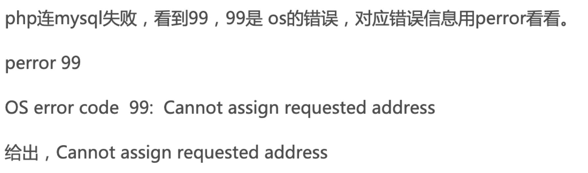
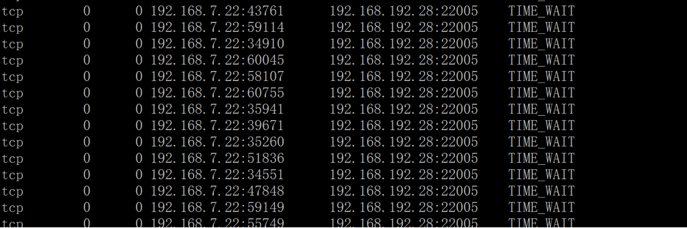
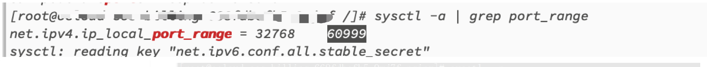
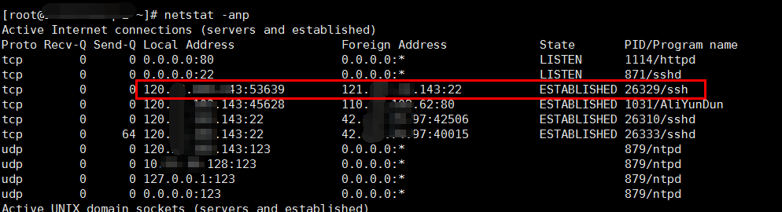

[toc]

# 虚拟网络运维------ Linux 内核配置相关问题记录

## 前言

云计算网络方向运维时，经常会遇到各类网络场景问题，其中受到Linux内核配置的影响是存在一定的比例的， 此类问题相对比较复杂，不易排查，这里长期更新，将遇到的涉及Linux内核配置影响的运维问题记录；

另外，涉及调整内核配置时，需要从实际需要出发，最好有相关数据的支撑，不建议随意调整内核参数。需要了解参数的具体作用，且注意同类型或版本环境的内核参数可能有所不同。并做好备份，方便回滚；

Linux 内核相关官方文档：https://www.kernel.org/doc/Documentation/networking/ip-sysctl.txt

[https://www.kernel.org/doc/Documentation/networking/ip-sysctl.txt](https://www.kernel.org/doc/Documentation/networking/ip-sysctl.txt)

[ip-sysctl.txt](./docfile/ip-sysctl.txt)

## 内核配置的查看和修改

**查看内核参数**：使用 `cat` 查看对应文件的内容，例如执行命令 `cat /proc/sys/net/ipv4/tcp_tw_recycle` 查看 `net.ipv4.tcp_tw_recycle` 的值。

**修改内核参数**：使用 `echo` 修改内核参数对应的文件，例如执行命令 `echo "0" > /proc/sys/net/ipv4/tcp_tw_recycle` 将 `net.ipv4.tcp_tw_recycle` 的值修改为 0。

- `/proc/sys/` 目录是 Linux 内核在启动后生成的伪目录，其目录下的 `net` 文件夹中存放了当前系统中开启的所有内核参数、目录树结构与参数的完整名称相关，如 `net.ipv4.tcp_tw_recycle`，它对应的文件是 `/proc/sys/net/ipv4/tcp_tw_recycle`，文件的内容就是参数值。
- 修改的参数值仅在当次运行中生效，系统重启后会回滚历史值，一般用于临时性的验证修改的效果。若需要永久性修改，需要修改sysctl.conf 文件；可以使用sysctl 命令管理；

**查看内核参数**：执行命令 `sysctl -a` 查看当前系统中生效的所有参数；

**修改内核参数**：

1. 执行命令 `/sbin/sysctl -w kernel.parameter="example"` 修改参数，如`sysctl -w net.ipv4.tcp_tw_recycle="0"`。
2. 执行命令 `vi /etc/sysctl.conf` 修改 `/etc/sysctl.conf` 文件中的参数。
3. 执行命令 `/sbin/sysctl -p` 使配置生效。

> **注意**：调整内核参数后内核处于不稳定状态，请酌情重启实例。


## 重点内核参数配置详述

### nf_conntrack 

- `net.netfilter.nf_conntrack_buckets`
- `net.nf_conntrack_max`

nf_conntrack(在老版本的 Linux 内核中叫 ip_conntrack)是一个内核模块,用于跟踪一个连接的状态的。连接状态跟踪可以供其他模块使用,最常见的两个使用场景是 iptables 的 nat 的 state 模块。 iptables 的 nat 通过规则来修改目的/源地址,但光修改地址不行,我们还需要能让回来的包能路由到最初的来源主机。这就需要借助 nf_conntrack 来找到原来那个连接的记录才行。而 state 模块则是直接使用 nf_conntrack 里记录的连接的状态来匹配用户定义的相关规则。

nf_conntrack 模块会使用一个哈希表记录 TCP 协议 established connection 记录，当这个哈希表满了的时候，便会导致 `nf_conntrack: table full, dropping packet` 错误。Linux 系统会开辟一个空间用来维护每一个 TCP 链接，这个空间的大小与 `nf_conntrack_buckets`、`nf_conntrack_max` 相关，后者的默认值是前者的 4 倍，而前者在系统启动后无法修改，所以一般都是建议调大 `nf_conntrack_max`。

> **注意**：系统维护连接比较消耗内存，请在系统空闲和内存充足的情况下调大 `nf_conntrack_max`，且根据系统的情况而定。

运维过程中，如果tcp连接数满后，就会导致Linux OS 出现丢包、高时延或断连等问题；具体表现是在`/var/log/message`

会打印类似：`kernel: nf_conntrack: table full, dropping packet.`


规避修改方案：

**修改内核配置`net.nf_conntrack_max`将配置参数调大；或 停止iptables(或 firewalld)服务，或添加iptables 规则禁止连接跟踪；**

```bash
lsmod | grep nf
sysctl -a | grep nf_conntrack
systemctl status firewalld
# iptables 规则类似这样
iptables -t raw -A PREROUTING -p tcp --dport 80 -j NOTRACK
iptables -t raw -A OUTPUT -p tcp --sport 80 -j NOTRACK
```

下列截图配置项都是依赖于模块 nf_conntrack，以及 如果iptables服务(或firewalld) 服务状态 active (running) ，iptables 会自动拉起nf_conntrack 模块；当stop 服务后，模块即会停用；






### tcp_max_tw_buckets

`net.ipv4.tcp_max_tw_buckets`

该字段的的官方说明

> tcp_max_tw_buckets - INTEGER
> 	Maximal number of timewait sockets held by system simultaneously.
> 	If this number is exceeded time-wait socket is immediately destroyed
> 	and warning is printed. This limit exists only to prevent
> 	simple DoS attacks, you _must_ not lower the limit artificially,
> 	but rather increase it (probably, after increasing installed memory),
> 	if network conditions require more than default value.

系统同时持有的最大timewait套接字数。如果超过此数量，则等待时间插座将立即销毁并打印警告。此限制的存在只是为了防止简单的DoS攻击，不建议人为地降低了极限，而是增加它（可能，增加安装的内存后），如果网络条件需要超过默认值。

```
sysctl -a | grep tcp_max_tw_buckets
```


**TIME_WAIT状态原理**
通信双方建立TCP连接后，主动关闭连接(即在tcp四次断开时，先发送fin报文的一方)的一方就会进入TIME_WAIT状态。
客户端主动关闭连接时，会发送最后一个ack后，然后会进入TIME_WAIT状态，再停留2个MSL时间(maximum segment lifetime 最大分节生命期)，进入CLOSED状态。

如果环境中time_wait连接数超过了内核配置tcp_max_tw_buckets 配置数据数量，则不会有新的time_wait 状态连接出现，

可能会出现两种异常情况：
 ① 对端服务器发完最后一个 Fin 包，没有收到当前服务器返回最后一个 Ack，又重发了 Fin 包，因为新的 TimeWait 没有办法创建 ，这个连接在当前服务器上就消失了，对端服务器将会收到一个 Reset 包。因为这个连接是明确要关闭的，所以收到一个 Reset 也不会有什么大问题。(但是违反了 TCP/IP 协议)
 ② 因为这个连接在当前服务器上消失，那么刚刚释放的端口可能被立刻使用，如果这时对端服务器没有释放连接，当前服务器就会收到对端服务器发来的 Reset 包。如果当前服务器是代理服务器，就可能会给用户返回 502 错误。(这种异常对服务或者用户是有影响的)

当Linux实例的time_wait 连接数大于或等于配置参数时，Linux 实例 `/var/log/message` 日志全是类似 `kernel: TCP: time wait bucket table overflow` 的报错信息，提示 `time wait bucket table` 溢出，如下：

```
Feb 18 12:28:38 i-*** kernel: TCP: time wait bucket table overflow
Feb 18 12:28:44 i-*** kernel: printk: 227 messages suppressed.
Feb 18 12:28:44 i-*** kernel: TCP: time wait bucket table overflow
Feb 18 12:28:52 i-*** kernel: printk: 121 messages suppressed.
```

通过netstat -anptu 会查看到大量的处于TIME_WAIT 状态的链接，未关闭的连接；

实际运维时，遇到过TIME_WAIT状态的连接数量过多，导致耗尽请求port数，进而无法发起新链接请求，出现访问失败的情况；(下面有案例)；

**原因分析**

参数 `net.ipv4.tcp_max_tw_buckets` 可以调整内核中管理 TIME_WAIT 状态的数量，当实例中处于 TIME_WAIT 及需要转换为 TIME_WAIT 状态连接数之和超过了 `net.ipv4.tcp_max_tw_buckets` 参数值时，message 日志中将报错 `time wait bucket table`，同时内核关闭超出参数值的部分 TCP 连接。需要根据实际情况适当调高 `net.ipv4.tcp_max_tw_buckets`，同时从业务层面去改进 TCP 连接。

在 TIME_WAIT 数量等于 tcp_max_tw_buckets 时，不会有新的 TIME_WAIT 产生。

**解决思路**

1. 执行命令 `netstat -anp |grep tcp |wc -l` 统计 TCP 连接数。
2. 执行命令 `vi /etc/sysctl.conf`，查询 `net.ipv4.tcp_max_tw_buckets` 参数。如果确认连接使用很高，容易超出限制。
3. **根据实际情况调整配置参数** `net.ipv4.tcp_max_tw_buckets`。
4. 执行命令 ` sysctl -p` 使配置生效。


另Linux内核中，还有两个配置 `net.ipv4.tcp_tw_recycle` 和 `net.ipv4.tcp_tw_reuse`；这两个配置项的调整需要慎重，可能会导致数据面的问题，影响转发；


### tcp_fin_timeout

`net.ipv4.tcp_fin_timeout`

> tcp_fin_timeout - INTEGER
> 	The length of time an orphaned (no longer referenced by any
> 	application) connection will remain in the FIN_WAIT_2 state
> 	before it is aborted at the local end.  While a perfectly
> 	valid "receive only" state for an un-orphaned connection, an
> 	orphaned connection in FIN_WAIT_2 state could otherwise wait
> 	forever for the remote to close its end of the connection.
> 	Cf. tcp_max_orphans
> 	Default: 60 seconds

- HTTP 服务中，Server 由于某种原因会主动关闭连接，例如 KEEPALIVE 超时的情况下。作为主动关闭连接的 Server 就会进入 FIN_WAIT2 状态。
- TCP/IP 协议栈中，存在**半连接**的概念，FIN_WAIT2 状态不算做超时，如果 Client 不关闭，FIN_WAIT_2 状态将保持到系统重启，越来越多的 FIN_WAIT_2 状态会致使内核 Crash。

网络上资料有两种说法 ：

一种是：调小 `net.ipv4.tcp_fin_timeout` 参数，减少这个数值以便加快系统关闭处于 `FIN_WAIT2` 状态的 TCP 连接；

另一种是：`net.ipv4.tcp_fin_timeout`这个数值其实是输出用的，修改之后并没有真正的读回内核中进行使用，而内核中真正管用的是一个宏定义，在 $KERNEL/include/net/tcp.h里面，有下面的行：`#define TCP_TIMEWAIT_LEN (60*HZ)`

<u>*目前这部分暂时没有条件验证确认；*</u>




## 其他内核参数配置概述

这里将其他的配置参数简单描述如下：

| 参数                                               | 描述                                                         |
| :------------------------------------------------- | :----------------------------------------------------------- |
| net.core.rmem_default                              | 默认的TCP数据接收窗口大小（字节）。                          |
| net.core.rmem_max                                  | 最大的TCP数据接收窗口（字节）。                              |
| net.core.wmem_default                              | 默认的TCP数据发送窗口大小（字节）。                          |
| net.core.wmem_max                                  | 最大的TCP数据发送窗口（字节）。                              |
| net.core.netdev_max_backlog                        | 当内核处理速度比网卡接收速度慢时，这部分多出来的包就会被保存在网卡的接收队列上，而该参数说明了这个队列的数量上限。在每个网络接口接收数据包的速率比内核处理这些包的速率快时，允许送到队列的数据包的最大数目。 |
| net.core.somaxconn                                 | 该参数定义了系统中每一个端口最大的监听队列的长度，是个全局参数。该参数和`net.ipv4.tcp_max_syn_backlog`有关联，后者指的是还在三次握手的半连接的上限，该参数指的是处于ESTABLISHED的数量上限。若您的ECS实例业务负载很高，则有必要调高该参数。`listen(2)`函数中的参数`backlog` 同样是指明监听的端口处于ESTABLISHED的数量上限，当`backlog`大于`net.core.somaxconn`时，以`net.core.somaxconn`参数为准。 |
| net.core.optmem_max                                | 表示每个套接字所允许的最大缓冲区的大小。                     |
| net.ipv4.tcp_mem                                   | 确定TCP栈应该如何反映内存使用，每个值的单位都是内存页（通常是4KB）。 第一个值是内存使用的下限。 第二个值是内存压力模式开始对缓冲区使用应用压力的上限。 第三个值是内存使用的上限。在这个层次上可以将报文丢弃，从而减少对内存的使用。对于较大的BDP可以增大这些值（注：其单位是内存页而不是字节）。 |
| net.ipv4.tcp_rmem                                  | 为自动调优定义Socket使用的内存。 第一个值是为Socket接收缓冲区分配的最少字节数。 第二个值是默认值（该值会被rmem_default覆盖），缓冲区在系统负载不重的情况下可以增长到这个值。 第三个值是接收缓冲区空间的最大字节数（该值会被rmem_max覆盖）。 |
| net.ipv4.tcp_wmem                                  | 为自动调优定义Socket使用的内存。 第一个值是为Socket发送缓冲区分配的最少字节数。 第二个值是默认值（该值会被wmem_default覆盖），缓冲区在系统负载不重的情况下可以增长到这个值。 第三个值是发送缓冲区空间的最大字节数（该值会被wmem_max覆盖）。 |
| net.ipv4.tcp_keepalive_time                        | TCP发送keepalive探测消息的间隔时间（秒），用于确认TCP连接是否有效。 |
| net.ipv4.tcp_keepalive_intvl                       | 探测消息未获得响应时，重发该消息的间隔时间（秒）。           |
| net.ipv4.tcp_keepalive_probes                      | 在认定TCP连接失效之前，最多发送多少个keepalive探测消息。     |
| net.ipv4.tcp_sack                                  | 启用有选择的应答（1表示启用），通过有选择地应答乱序接收到的报文来提高性能，让发送者只发送丢失的报文段，（对于广域网通信来说）这个选项应该启用，但是会增加对CPU的占用。 |
| net.ipv4.tcp_fack                                  | 启用转发应答，可以进行有选择应答（SACK）从而减少拥塞情况的发生，这个选项也应该启用。 |
| net.ipv4.tcp_timestamps                            | TCP时间戳（会在TCP包头增加12B），以一种比重发超时更精确的方法（参考RFC 1323）来启用对RTT的计算，为实现更好的性能应该启用这个选项。 |
| net.ipv4.tcp_window_scaling                        | 启用RFC 1323定义的window scaling，要支持超过64KB的TCP窗口，必须启用该值（1表示启用），TCP窗口最大至1GB，TCP连接双方都启用时才生效。 |
| net.ipv4.tcp_syncookies                            | 该参数表示是否打开TCP同步标签（`SYN_COOKIES`），内核必须开启并编译CONFIG_SYN_COOKIES，`SYN_COOKIES`可以防止一个套接字在有过多试图连接到达时，引起过载。默认值0表示关闭。 当该参数被设置为1，且`SYN_RECV`队列满了之后，内核会对SYN包的回复做一定的修改，即在响应的SYN+ACK包中，初始的序列号是由源IP+Port、目的IP+Port及时间这五个参数共同计算出一个值组成精心组装的TCP包。由于ACK包中确认的序列号并不是之前计算出的值，恶意攻击者无法响应或误判，而请求者会根据收到的SYN+ACK包做正确的响应。启用`net.ipv4.tcp_syncookies`后，会忽略`net.ipv4.tcp_max_syn_backlog`。 |
| net.ipv4.tcp_tw_reuse                              | 表示是否允许将处于TIME-WAIT状态的Socket（TIME-WAIT的端口）用于新的TCP连接。 |
| net.ipv4.tcp_tw_recycle                            | 能够更快地回收TIME-WAIT套接字。                              |
| net.ipv4.tcp_fin_timeout                           | 对于本端断开的Socket连接，TCP保持在FIN-WAIT-2状态的时间（秒）。对方可能会断开连接或一直不结束连接或不可预料的进程死亡。 |
| net.ipv4.ip_local_port_range                       | 表示TCP/UDP协议允许使用的本地端口号。                        |
| net.ipv4.tcp_max_syn_backlog                       | 该参数决定了系统中处于`SYN_RECV`状态的TCP连接数量。`SYN_RECV`状态指的是当系统收到SYN后，作为SYN+ACK响应后等待对方回复三次握手阶段中的最后一个ACK的阶段。对于还未获得对方确认的连接请求，可保存在队列中的最大数目。如果服务器经常出现过载，可以尝试增加这个数字。默认为1024。 |
| net.ipv4.tcp_low_latency                           | 允许TCP/IP栈适应在高吞吐量情况下低延时的情况，这个选项应该禁用。 |
| net.ipv4.tcp_westwood                              | 启用发送者端的拥塞控制算法，它可以维护对吞吐量的评估，并试图对带宽的整体利用情况进行优化，对于WAN通信来说应该启用这个选项。 |
| net.ipv4.tcp_bic                                   | 为快速长距离网络启用Binary Increase Congestion，这样可以更好地利用以GB速度进行操作的链接，对于WAN通信应该启用这个选项。 |
| net.ipv4.tcp_max_tw_buckets                        | 该参数设置系统的TIME_WAIT的数量，如果超过默认值则会被立即清除。默认为180000。 |
| net.ipv4.tcp_synack_retries                        | 指明了处于SYN_RECV状态时重传SYN+ACK包的次数。                |
| net.ipv4.tcp_abort_on_overflow                     | 设置该参数为1时，当系统在短时间内收到了大量的请求，而相关的应用程序未能处理时，就会发送Reset包直接终止这些链接。建议通过优化应用程序的效率来提高处理能力，而不是简单地Reset。默认值为0。 |
| net.ipv4.route.max_size                            | 内核所允许的最大路由数目。                                   |
| net.ipv4.ip_forward                                | 接口间转发报文。                                             |
| net.ipv4.ip_default_ttl                            | 报文可以经过的最大跳数。                                     |
| net.netfilter.nf_conntrack_tcp_timeout_established | 在指定之间内，已经建立的连接如果没有活动，则通过iptables进行清除。 |
| net.netfilter.nf_conntrack_max                     | 哈希表项最大值。                                             |

## 运维问题记录

### 问题1：client port 耗尽无法发起请求，概率性连接失败

**问题现象**

client 概率性连接db实例失败，报错：`ERROR 2003(HY000):Can't connect to Mysql server on '192.168.192.28' (99)`



报错回显 google 后，发现是php相关回显，报错代码 99；



根据google 回显，判断是client 存在限制，另复测其他client 未出现该问题，server 端监控也未见异常；

**原因分析**

检查client 连接数端口 `netstat -anptu | wc -l`



查看发现有大量time_wait状态连接，进一步检查client 端内核相关配置；



所以客户端 就是在 这个 范围 内，60999 - 32768 = 28231   满了之后就可能会导致无法分配新的客户端端口发起请求；

```
sysctl -a | grep port_range
```

由于大量time_wait 状态连接占用连接数，修改内核参数中对 time_wait 状态连接的最大数量，释放连接；

```
[root@c9c5b5d95-z7jlj /]# sysctl -a | grep tw
net.ipv4.tcp_max_tw_buckets = 524288
```

**解决方案**


规避修改后，问题规避；

后续发现是由于db中缺少一张表，程序持续发起连接重试，导致有大量短连接请求，耗尽port，触发问题；

*另此次问题client 是kubernetes pod，内核配置是pod内配置，pod跨node节点访问db实例：*

*数据链路是pod -----> svc ----> LB ---- DB*

*<u>另 kubernetes中，不能修改pod sysctl 内核配置中的tw参数，k8s  不能开 tw 参数，不能开tcp_tw_reuse 和tcp_tw_recycle，这两个参数开了后会影响nat转发；</u>*


另外之前也遇到过，产品转发特性，会特定使用一些特定的端口，如果请求分配到这些端口时，就会出现请求报错或os 丢包；

### 问题2：Linux OS NAT哈希表满导致丢包(nf_conntrack)

问题现象

Linux 实例出现丢包、断连等网络异常现象；根据抓包等网络排查方案，定界丢包为该实例时；在系统日志中重复出现大量类似以下错误信息。

```
Feb  6 16:05:07 i-*** kernel: nf_conntrack: table full, dropping packet.
Feb  6 16:05:07 i-*** kernel: nf_conntrack: table full, dropping packet.
Feb  6 16:05:07 i-*** kernel: nf_conntrack: table full, dropping packet.
Feb  6 16:05:07 i-*** kernel: nf_conntrack: table full, dropping packet.
```

原因分析

ip_conntrack是Linux系统内NAT的一个跟踪连接条目的模块。ip_conntrack模块会使用一个哈希表记录TCP协议“established connection”记录，当这个哈希表满之后，便会导致“`nf_conntrack: table full, dropping packet`”错误。Linux系统会开辟一个空间，用于维护每一个TCP链接，这个空间的大小与`nf_conntrack_buckets`、`nf_conntrack_max`参数相关，后者的默认值是前者的4倍，所以一般建议调大`nf_conntrack_max`参数值。

> **说明**：系统维护连接比较消耗内存，请在系统空闲和内存充足的情况下调大`nf_conntrack_max`参数，且根据系统的情况而定。

解决方法

**修改内核配置`net.nf_conntrack`对应配置参数；**

**或 停止iptables(或 firewalld)服务，或添加iptables 规则禁止连接跟踪；**

如果选择修改内核配置`net.nf_conntrack`对应配置参数，可参考如下操作：

1. 执行以下命令，编辑系统内核配置。

    ```
    vi /etc/sysctl.conf
    ```

2. 修改哈希表项最大值参数`net.netfilter.nf_conntrack_max`为`655350`。

3. 修改超时参数`net.netfilter.nf_conntrack_tcp_timeout_established`为`1200`，默认情况下超时时间是432000秒。

4. 执行`sysctl -p`命令，使配置生效。


### 问题3：报“Time wait bucket table overflow”错误（tcp_max_tw_buckets）

> 此处涉及的内核参数为`net.ipv4.tcp_max_tw_buckets`。

问题现象

- Linux实例的`/var/log/message`日志信息全是类似`kernel: TCP: time wait bucket table overflow`的报错信息，提示`time wait bucket table`”溢出，系统显示类似如下。

    ```
Feb 18 12:28:38 i-*** kernel: TCP: time wait bucket table overflow
    Feb 18 12:28:44 i-*** kernel: printk: 227 messages suppressed.
    Feb 18 12:28:44 i-*** kernel: TCP: time wait bucket table overflow
    Feb 18 12:28:52 i-*** kernel: printk: 121 messages suppressed.
Feb 18 12:28:52 i-*** kernel: TCP: time wait bucket table overflow
    Feb 18 12:28:53 i-*** kernel: printk: 351 messages suppressed.
Feb 18 12:28:53 i-*** kernel: TCP: time wait bucket table overflow
    Feb 18 12:28:59 i-*** kernel: printk: 319 messages suppressed.
    ```
    
- 执行以下命令，统计处于TIME_WAIT状态的TCP连接数，发现处于TIME_WAIT状态的TCP连接非常多。

    ```
    netstat -ant|grep TIME_WAIT|wc -l
    ```

原因分析

参数`net.ipv4.tcp_max_tw_buckets`可以调整内核中管理TIME_WAIT状态的数量。当实例中处于TIME_WAIT状态，及需要转换为TIME_WAIT状态的连接数之和超过`net.ipv4.tcp_max_tw_buckets`参数值时，message日志中将报“`time wait bucket table`” 错误，同时内核关闭超出参数值的部分TCP连接。您需要根据实际情况适当调高`net.ipv4.tcp_max_tw_buckets`参数，同时从业务层面去改进TCP连接。

解决方法

1. 执行以下命令，统计TCP连接数。

    ```
    netstat -anp |grep tcp |wc -l
    ```

2. 执行以下命令，查询`net.ipv4.tcp_max_tw_buckets`参数。如果确认连接使用很高，则容易超出限制。

    ```
    vi /etc/sysctl.conf
    ```

1. 根据现场情况，增加`net.ipv4.tcp_max_tw_buckets`参数值的大小。

1. 执行`sysctl -p`命令，使配置生效。


### 问题4：Linux实例中FIN_WAIT2状态的TCP链接过多

> **注意**：此处涉及的内核参数为`net.ipv4.tcp_fin_timeout`。

问题现象

FIN_WAIT2状态的TCP链接过多。

原因分析

- 在HTTP服务中，Server由于某种原因会主动关闭连接，例如KEEPALIVE超时的情况下。作为主动关闭连接的Server就会进入FIN_WAIT2状态。
- 在TCP/IP协议栈中，存在半连接的概念，FIN_WAIT2状态不算超时，如果Client不关闭，FIN_WAIT2状态将保持到系统重启，越来越多的FIN_WAIT2状态会致使内核Crash。
- 建议调小`net.ipv4.tcp_fin_timeout`参数的值，以便加快系统关闭处于`FIN_WAIT2`状态的TCP连接。

解决方法

1. 执行

    ```
    vi /etc/sysctl.conf
    ```

    命令，修改或增加以下内容。

    ```
    net.ipv4.tcp_syncookies = 1
    net.ipv4.tcp_fin_timeout = 30
    net.ipv4.tcp_max_syn_backlog = 8192
    net.ipv4.tcp_max_tw_buckets = 5000
    ```

2. 执行

    ```
    sysctl -p
    ```

    命令，使配置生效。

    > **注意**：由于`FIN_WAIT2`状态的TCP连接会进入`TIME_WAIT`状态，请同时参见报“Time wait bucket table overflow”错误这个问题。

### 问题5：Linux实例中出现大量CLOSE_WAIT状态的TCP连接

问题现象

执行以下命令，发现当前系统中处于`CLOSE_WAIT`状态的TCP连接非常多。

```
netstat -atn|grep CLOSE_WAIT|wc -l
```

原因分析

根据实例上的业务量判断CLOSE_WAIT数量是否超出了正常的范围。TCP连接断开时需要进行四次挥手，TCP连接的两端都可以发起关闭连接的请求，若对端发起了关闭连接，但本地没有关闭连接，那么该连接就会处于CLOSE_WAIT状态。虽然该连接已经处于半开状态，但是已经无法和对端通信，需要及时的释放该连接。建议从业务层面及时判断某个连接是否已经被对端关闭，即在程序逻辑中对连接及时关闭，并进行检查。

解决方法

编程语言中对应的读、写函数一般包含了检测CLOSE_WAIT状态的TCP连接功能，可通过执行以下命令，查看当前实例上处于CLOSE_WAIT状态的连接数。Java语言和C语言中关闭连接的方法如下。

```
netstat -an|grep CLOSE_WAIT|wc -l
```

**Java语言**

1. 通过`read`方法来判断I/O 。当read方法返回`-1`时，则表示已经到达末尾。
2. 通过`close`方法关闭该链接。

**C语言**

检查`read`的返回值。

- 若等于0，则可以关闭该连接。
- 若小于0，则查看error，若不是AGAIN，则同样可以关闭连接。

### 问题6：客户端配置NAT后仍无法访问ECS或RDS远端服务器

> **说明**：此处涉及的内核参数如下。
>
> - `net.ipv4.tcp_tw_recycle`
> - `net.ipv4.tcp_timestamps`

问题现象

客户端配置NAT后无法访问远端ECS、RDS，包括配置了SNAT的VPC中的ECS实例。同时无法访问其他ECS或RDS等云产品，抓包检测发现远端ECS和RDS对客户端发送的SYN包没有响应。

原因分析

若远端服务器的内核参数`net.ipv4.tcp_tw_recycle`和`net.ipv4.tcp_timestamps`的值都为1，则远端服务器会检查每一个报文中的时间戳（Timestamp），若Timestamp不是递增的关系，不会响应这个报文。配置NAT后，远端服务器看到来自不同客户端的源IP相同，但NAT前每一台客户端的时间可能会有偏差，报文中的Timestamp就不是递增的情况。

解决方法

- 远端服务器为ECS时，修改`net.ipv4.tcp_tw_recycle`参数为0。
- 远端服务器为RDS等PaaS服务时。RDS无法直接修改内核参数，需要在客户端上修改`net.ipv4.tcp_tw_recycle`参数和`net.ipv4.tcp_timestamps`参数为0。

### 问题7：存在大量处于TIME_WAIT状态的连接

> **说明**：此处涉及的内核参数如下。
>
> - net.ipv4.tcp_syncookies
> - net.ipv4.tcp_tw_reuse
> - net.ipv4.tcp_tw_recycle
> - net.ipv4.tcp_fin_timeout

问题现象

云服务器中存在大量处于TIME_WAIT状态的连接。

原因分析

首先通过调用close()发起主动关闭，在发送最后一个ACK之后会进入time_wait的状态，该发送方会保持2MSL时间之后才会回到初始状态。MSL值是数据包在网络中的最大生存时间。产生这种结果使得这个TCP连接在2MSL连接等待期间，定义这个连接的四元组（客户端IP地址和端口，服务端IP地址和端口号）不能被使用。

解决方法

通过`netstat`或`ss`命令，可以看到大量处于TIME_WAIT状态的连接。

1. 执行以下命令，查看TIME_WAIT状态的连接数量。

    ```
    netstat -n | awk '/^tcp/ {++y[$NF]} END {for(w in y) print w, y[w]}'
    ```

2. 执行以下命令，编辑系统内核配置。

    ```
    vi /etc/sysctl.conf
    ```

    修改或加入以下内容。

    ```
    net.ipv4.tcp_syncookies = 1 
    net.ipv4.tcp_tw_reuse = 1 
    net.ipv4.tcp_tw_recycle = 1
    net.ipv4.tcp_fin_timeout = 30
    ```

3. 执行命令以下命令，使配置生效。

    ```
    /sbin/sysctl -p 
    ```

### 问题8：服务端断开连接后客户端仍然可以看到是建立连接的

> **注意**：此处涉及的内核参数为`net.ipv4.tcp_fin_timeout`。

问题现象

服务端A与客户端B建立了TCP连接，之后服务端A主动断开了连接，但是在客户端B上仍然看到连接是建立的。

[](https://onekb.oss-cn-zhangjiakou.aliyuncs.com/1264869/fa42e048-fd6f-4ddc-a742-6686aebf3a71.png)

[](http://docs-aliyun.cn-hangzhou.oss.aliyun-inc.com/assets/pic/52868/cn_zh/1502674853044/clienta.png)

原因分析

通常是由于修改了服务端默认的`net.ipv4.tcp_fin_timeout`内核参数所致。

解决方法

1. 执行以下命令，修改配置，设置

    ```
    net.ipv4.tcp_fin_timeout=30
    ```

    。

    ```
     vi /etc/sysctl.conf
    ```

2. 执行以下命令，使配置生效。

    ```
    sysctl -p
    ```

### 问题9：无法在本地网络环境通过SSH连接Linux实例

> **说明**：此处涉及的内核参数如下。
>
> - net.ipv4.tcp_tw_recycle
> - net.ipv4.tcp_timestamps

问题现象

无法在本地网络环境通过SSH连接Linux实例，或者访问该Linux实例上的HTTP业务出现异常。Telnet测试会被reset。

原因分析

如果您的本地网络是NAT共享方式上网，该问题可能是由于本地NAT环境和目标Linux相关内核参数配置不匹配导致。尝试通过修改目标Linux实例内核参数来解决问题。

1. 远程连接目标Linux实例。

2. 执行如下命令，查看当前配置。

    ```
    cat /proc/sys/net/ipv4/tcp_tw_recycle
    cat /proc/sys/net/ipv4/tcp_timestamps
    ```

3. 查看上述两个配置的值是否为**0**，如果为**1**，NAT环境下的请求可能会导致上述问题。

解决方法

通过如下方式将上述参数值修改为0。

1. 执行如下命令，修改配置文件。

    ```
    vi /etc/sysctl.conf
    ```

2. 添加如下内容。

    ```
    net.ipv4.tcp_tw_recycle=0
    net.ipv4.tcp_timestamps=0
    ```

3. 执行如下命令，使配置生效。

    ```
    sysctl -p 
    ```

4. 重新SSH登录实例，或者进行业务访问测试。

